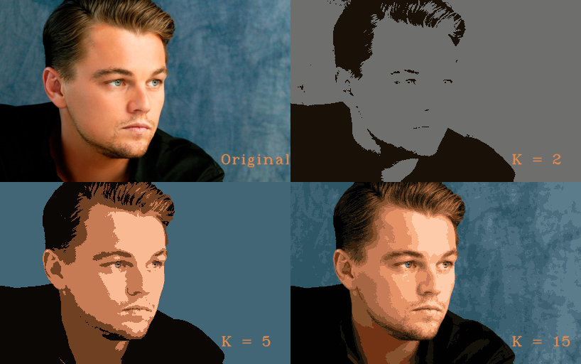

# Image-Clustering
Image clustering using K-Means algorithm in C++.


### Build

```bash
$ mkdir build && cd build
$ cmake ..
$ make
```

##### Prerequisites

- `CMake` 2.8 or above
- `OpenCV` 3.0 or above

##### Limitations

- Currently only 2-Dimensional Image arrays with 3-channels are supported in this project.

### Description:

This project aims to do Image clustering using K-Means clustering algorithm. Written in C++.

##### Clustering:

Clustering is a task to separate a given training data into clusters where similar data points belong  to the same cluster. 

K-Means is one of the algorithms to perform clustering task. It aims to partition `n` observations into `k` clusters in which each observation belongs to the cluster with the nearest cluster centroid. 

Clustering has many applications like Document Segmentation, Image Compression,  Image Segmentation etc. Image Segmentation is used in many applications of Moving Object Detection, Machine Vision, Face Recognition, Fingerprint Recognition, Medical Imaging and Video Surveillance etc. Image Segmentation can be done with K-Means along with other algorithms. This project helps you do Image Clustering (a basic version of Image Segmentation) using K-Means algorithm. 


### Results:

#### Varying number of clusters:



​																		Figure 1. Image clustering with K = 2, 5, 15 clusters.

#### Image clustering vs Number of clusters:


​														Figure 2 : Image clustering results in sequence from K = 2 to K = 15.

#### Visualising K-Means algorithm progression:


​																Figure 3 : Depicting the progress of K-Means algorithm (used K = 15)